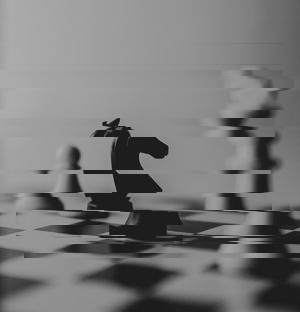
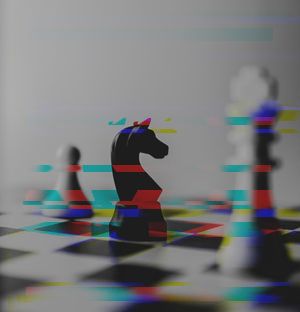
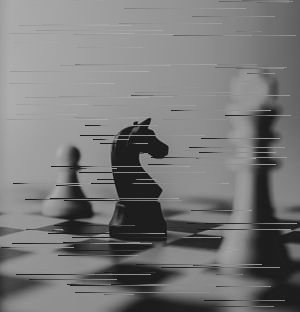
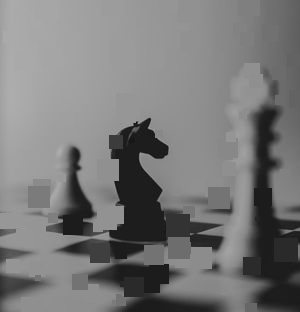

# <center>Imgge</center>

Package creates randomized glitch effects that can be applied to images
or on consecutive frames for animations. Functions can be created by calling
functions such as NewShift or NewPixelSort. All effects
made to work with the draw.Image type.

## Documentation
[pkg.go.dev/github.com/keithroger/imgge](https://pkg.go.dev/github.com/keithroger/imgge)

## Install
```
$ go get github.com/keithroger/imgge
```


## Effects
The Effect interface is used to impliment all effects.
```go
type Effect interface {
	// Draws the effect to the image with with the current
    // settings defined by the struct.
	Apply(draw.Image)

	// Next makes small variations to the effect.
	// Use in a sequence of images to produce an animated effect.
	Next()

	// Resets random components of effect.
	Randomize()
}
```

### Shift


<details>
<summary>View Example</summary>

```go
// Import jpeg using included function
img, err := imgge.JpegToImage("images/original.jpg")
if err != nil {
	log.Fatal(err)
}

// Create and Apply Effect
effect := imgge.NewShift(img.Bounds(), 20, 30, 22)
effect.Apply(img)

// Export to png using included function
err = imgge.SaveAsPng("Shift.png", img)
if err != nil {
	log.Fatal(err)
}
```
</details>

### Color Shift


<details>
<summary>View Example</summary>

```go
// Import jpeg using included function
img, err := imgge.JpegToImage("images/original.jpg")
if err != nil {
	log.Fatal(err)
}

// Create and Apply Effect
effect := imgge.NewColorShift(img.Bounds(), 20, 30, 25)
effect.Apply(img)

// Export to png using included function
err = imgge.SaveAsPng("ColorShift.png", img)
if err != nil {
	log.Fatal(err)
}
```
</details>

### Pixel Sort


<details>
<summary>View Example</summary>

```go
// Import jpeg using included function
img, err := imgge.JpegToImage("images/original.jpg")
if err != nil {
	log.Fatal(err)
}

// Create and Apply Effect
effect := imgge.NewPixelSort(img.Bounds(), 50, 100, "horiz")
effect.Apply(img)

// Export to png using included function
err = imgge.SaveAsPng("PixelSort.png", img)
if err != nil {
	log.Fatal(err)
}
```
</details>


### Pixel Pop


<details>
<summary>View Example</summary>

```go
// Import jpeg using included function
img, err := imgge.JpegToImage("images/original.jpg")
if err != nil {
	log.Fatal(err)
}

// Create and Apply Effect
effect := imgge.NewPixelPop(img.Bounds(), 15, 50, 100)
effect.Apply(img)

// Export to png using included function
err = imgge.SaveAsPng("PixelPop.png", img)
if err != nil {
	log.Fatal(err)
}
```
</details>